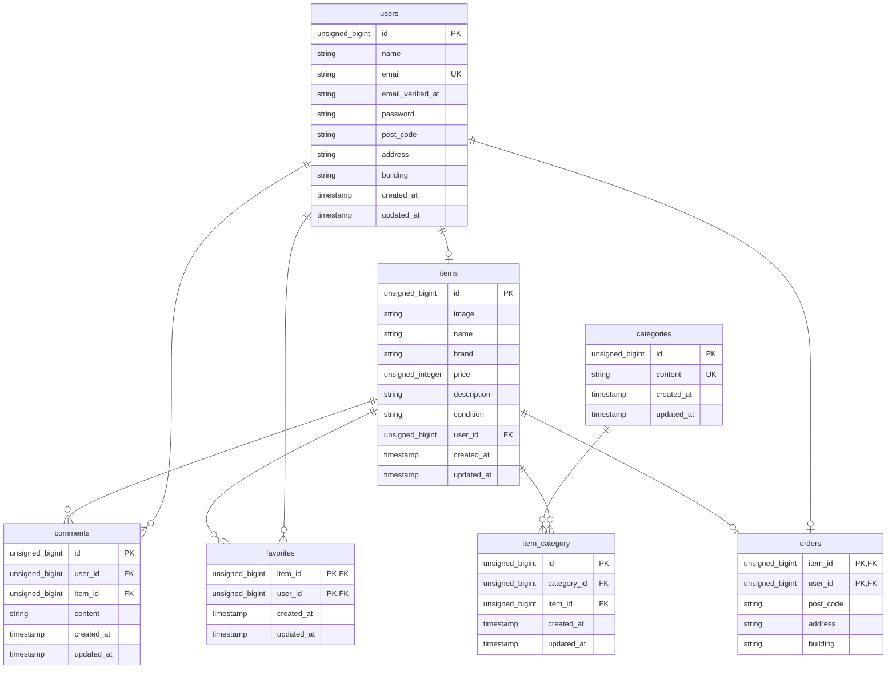

# FreeMarketApp

## 環境構築
### Dockerビルド
1. ```git clone https://github.com/itoro967/FreeMarketApp.git```
1. ```cd FreeMarketApp```
1. ```sudo docker-compose up -d --build```

### Laravel環境構築
1. ```sudo docker-compose exec php bash```
1. ```composer install```
1. ```cp .env.example .env``` ※動作しない場合は環境に応じて書き換えてください。
1. ```php artisan key:generate```
1. ```php artisan migrate```
1. ```php artisan db:seed```
1. ```php artisan storage:link```
1. 完了

## 仕様技術(実行環境)
- Laravel 10.48.22
- MailHog ※最新版を使用
- nginx 1.27.2
- MySQL 9.0.1
- PHP 8.2-fpm


## ER図


## URL
- 開発環境 : http://localhost/
- MailHog : http://localhost:8025/

## 仕様について
1. 検証メッセージはlangファイルで指定
